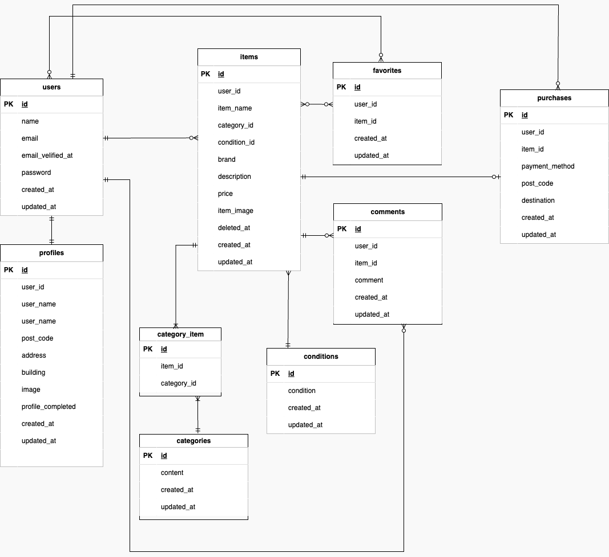

# coachtechフリマ （FleaMarket）

## 環境構築

### Docker ビルド
- 1.git clone git@github.com:okumurachie/Flea-market.git
- 2.docker-compose up -d --build

### laravel 環境構築
- 1.docker-compose exec php bash
- 2.composer install
- 3.cp .env.example .env(.env.example ファイルから.env を作成し、環境変数を変更)
- 4.php artisan key:generate
- 5.php artisan migrate
- 6.php artisan db:seed

## 使用技術
- PHP 8.4.8
- Laravel 10.48.29
- MySQL 8.0
- nginx 1.21.1

## ER 図

## 開発環境

- 商品一覧画面（トップ画面）：http://localhost/
- 会員登録：http://localhost/register
- phpMyAdmin:http://localhost:8080/
# Flea-market
